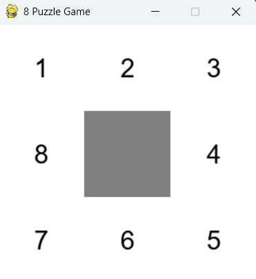

# Solving the 8-Puzzle Problem with Breadth-First Search (BFS)
This repository contains code that employs the breadth-first search algorithm to solve a puzzle game called the 8-puzzle. This project is the first of five required projects for ENPM661 (Planning for Autonomous Robots). This is a course I am taking at the University of Maryland as I pursue my M.Eng. in Robotics Engineering. 

**Figure 1.** This project centers around employing a well-established path planning algorithm called breadth-first search (BFS) to systematically solve a puzzle game called the 8-puzzle.   

## How to Run this Code
1. Clone or download this repository
2. Run `proj1_ronen_aniti.py`. Modify the start and goal configuration (bottom of file) to test different cases. 
3. Animate the results by running `Animate.py`, a Python file I include in this repository, which was provided to us in class. 

## What Libraris I Used in this Code
### For My Solution, proj1_ronen_aniti.py:
For my solution, proj1_ronen_aniti.py, I use the `queue` module, which belongs to the Python standard library. I don't use any other libraries. 
### For `Animate.py`, provided by the instructor:
The animation script I've included in this repository was developed in prior years by students or teachers of this course. The script uses `Numpy`, `pygame`, and `time`. The `time` module belongs to the Python Standard Library. 

## Rubric Points
The following is the list of rubric points I have designed my solution to conform to. For each bullet point, I will explain, briefly, how my solution conforms. 

### Point 1: Node Data Structure
>"Correct data structures used to store the node information such as node state, node index and parent node index."

My solution does well to conform to this rubric point. I employ a dictionary to store the node information, that is the node state, node index, and parent node index. A dictionary is correct because it allows for approximate constant time access to node information, which is efficient. Also, a dictionary allows for the intuitive and thus human understandable organization of node information. In my implementation, I set the key of the dictionary as the node index, and I set the value for the key as being a tuple containing three elements: parent node index, the board state, and the action required to get to the node from the parent. 

### Point 2: Node Exploration Method
>"Functions for generating new nodes from the parent nodes. Also, check for duplicate/visited nodes."

My solution does well to conform to this bullet point. I implement four functions to expand the search tree: move_right, move_left, move_up, and move_down. Each function generates a new state from the prior state by swapping the blank tile with an adjacent one. The reason I did not implement this move functionality as a single function with a direction parameter is because I was trying to conform closely to the guidelines in the project rubric, which contain explicit instruction to "Write four subfunctions to move the blank tile in four different directions." Also, as for checking for duplicate and visited nodes, my solution does this by maintaining a set of visited states, which is updated with states that are expanded before these states are enqueued (i.e., added to the FIFO queue). There are checks I implement that leverage this visited set to prevent the algorithm from processing board states already belonging to that set.

### Point 3: Backtracking 
>"Implementation of backtracking to find the correct path"

My solution does well to conform to this bullet point. I implement a function that achieves backtracking, called `backtrack`. It requires two parameters: `search_tree` and `goal_node_index`. Through a `while` loop, it generates a sequence from the goal node to the start node, which it then reverses to produce the final path. The function returns both a path of board states, `path_of_states`, and a `path_of_actions`, which indicates the sequence of actions taken by the blank tile in moving from the starting board state to the goal board state. 

### Point 4: Computation Time
>"The code should be able to find the solution for an input that needs up to 31 steps within 10 minutes."

My solution does well to conform to this bullet point. I know this because it finds the correct path for the start and goal configuration provided in lecture within the five steps, which we know to be the correct number of steps. It computes this path instantly.

### Point 5: Submission guidelines compliance
> "Submit all the required text files, README, and the Python file."

My solution does well to conform to this rubric point. The files `proj1_ronen_aniti.py`, `README.md`, `NodesInfo.txt`, `nodes.txt`, `nodePath.txt`, and `Animate.py` comprise this repository. The files contain what they are supposed to contain as per the detailed instructions for this project.  

## Recommended Steps from Lecture
The following is the list of recommended steps for solving this problem. Like I did for the rubric points above, for each recommended step from lecture, I will briefly explain how my solution conforms.

### Recommended Step 1: Selection of Data Structure 
> "You should first select a data structure type to
save your generated nodes. There are different types of data structure that could be used. The type of data structure is
optional. Hint: Read about: lists, dictionaries, hash
tables, stacks and queues"

My solution does well to conform to this recommended step. I've already explained why in my explanation (shown above) for how my project conforms to Point 1.  

### Recommended Step 2: Write a Function to Find the Blank Tile
>"Write a function that given the state of the current node in the 8puzzle problem, calculates the location of the blank tile in the 3
by 3 matrix and returns the output as a pair, (i,j). Where 0≤i ≤ 2 and 0≤ j ≤ 2. Blank tile can be located using either two for loops or by using inbuilt functions of numpy."

My solution does well to conform to this recommended step. I have implemented a function called `find_the_blank`, which does exactly what the name suggests by means of a double `for` loop. 

### Recommended Step 3: Write Four Subfunctions for Moving the Blank Tile
>"Write 4 subfunctions to move the blank tile in
4 different directions"

>[Status, NewNode] = ActionMoveLeft(CurrentNode);
% Moves blank tile left, if possible

>[Status, NewNode] = ActionMoveRight(CurrentNode);
% Moves blank tile right, if possible

>[Status, NewNode] = ActionMoveUp(CurrentNode);
% Moves blank tile up, if possible

>[Status, NewNode] = ActionMoveDown(CurrentNode);
% Moves blank tile down, if possible"

My solution does well to conform to this recommended step. I have already explained how when I explained (above) how my solution conforms to Point 2. 

### Recommended Step 4: Append All the Possible New Nodes to a List
>"Append all the possible new nodes in a list. Additional: Focus on checking the node to be explored with the visited list you maintain and
if it is present do not repeat the action set for that node."

Reading this guideline, I'm assuming what is meant here is that, within the BFS main loop, I store, as a list, the neighbors to the node being processed. My solution actually doesn't do this. Instead it stores each neighbor as a separate variable. The reason for this is because I, as per Recommended Step 3, store each neighbor using a separate variable name. So I thought it would be redundant to further organize these four separate variable names into a list. 

### Write a Backtracking Function to Find the Path from Start to Goal
>"Write a subfunctions (generate_path) that uses back tracking to find the path between the initial node and final node."

My solution does well to conform to this recommended step. I have already explained why in my response to Point 3.

